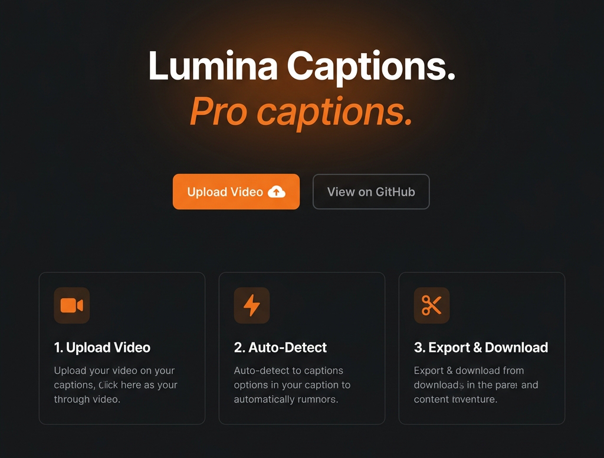

<div align="center">

</div>

# Lumina Captions

> **100% Local, Browser-Based AI Video Captioning.** Privacy-first, professional styles, zero server lag, and absolutely no watermarks or subscriptions.

Lumina Captions is a modern web application designed for content creators, vloggers, and educators who want premium social media captions without sacrificing their privacy or wallet. By utilizing on-device AI, all audio extraction, voice activity detection, transcription, and video rendering happen entirely in your web browser. 

---

## Key Features

* 🔒 **100% Private & Local**: Your video files never leave your computer. Audio extraction and speech-to-text models run completely on-device.
* 🎙️ **Smart Speech Detection**: Employs manual audio chunking heuristics and silence/voice activity detection to maintain pinpoint caption timing and bypass transcription drift.
* 🎨 **Social-Ready Styles**: Customize typography, sizes, positions, text strokes, and backgrounds, or choose from premium built-in presets (Modern, Neon, Minimal, etc.).
* ✨ **Word-Level Highlighting**: Highlight the spoken word in real-time as the video plays, matching popular formats on TikTok, Instagram Reels, and YouTube Shorts.
* 🚀 **In-Browser Export**: Render and download high-resolution captioned videos (MP4/WebM) directly from your browser.
* 💾 **Saved Presets**: Save, rename, and manage your custom styles locally using browser local storage.

---

## How It Works Under the Hood

Lumina Captions orchestrates several web APIs and libraries to deliver local high-performance processing:

1. **Audio Extraction**: Extracts audio tracks from uploaded video files using the Web Audio API and `AudioContext`.
2. **On-Device Whisper AI**: Uses **Transformers.js** to load and run lightweight Hugging Face speech models (e.g., Whisper) directly in a Web Worker via ONNX Runtime Web.
3. **Silence Correction**: Chunks audio sequences into manageable segments using voice activity heuristics to correct timestamp padding and prevent caption drift.
4. **Canvas Rendering**: Draws text, backgrounds, and highlighting frames onto an HTML5 Canvas synced to the video playback rate.
5. **Video Exporting**: Records canvas frames and audio tracks using the `MediaRecorder` API to assemble and package the finished captioned video inside the browser.

---

## Getting Started

### Prerequisites

You need **Node.js** (v18 or higher recommended) installed on your system.

### Running Locally

1. **Clone the Repository**:
   ```bash
   git clone https://github.com/Fr0z3nRebel/lumina-captions.git
   cd lumina-captions
   ```

2. **Install Dependencies**:
   ```bash
   npm install
   ```

3. **Start the Development Server**:
   ```bash
   npm run dev
   ```

4. **Open in Browser**:
   Navigate to `http://localhost:3000` to start captioning.

---

## Deployment

Since Lumina Captions is fully client-side, it builds into a set of static assets ready for fast static hosting:

### Deploying to Vercel

The repository comes pre-configured with a `vercel.json` file. 

1. Import the repository in [Vercel](https://vercel.com/new).
2. The framework preset **Vite** and output directory **dist** will be automatically selected.
3. Click **Deploy**. No backend database or API keys are required.

---

## License

This project is licensed under the MIT License - see the [LICENSE](LICENSE) file for details.

---

## Creator

Created with ❤️ by **John Adams** / [Lefty Studios, LLC](https://leftystudios.com). 

*If you find this application useful, please consider [buying me a coffee](https://buymeacoffee.com/john.adams) to support further development!*
